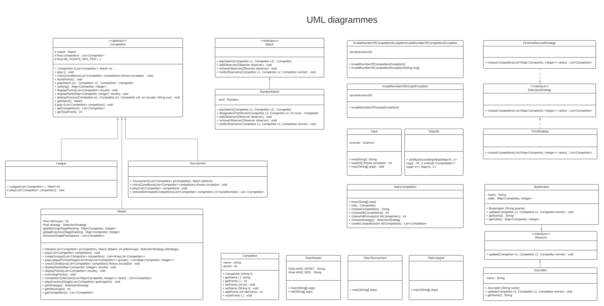

# Projet Competitions Sportives



# Sujet

Réalisation et modélisation d’un Competitions Sportives, cette modélisation permettra d’implanter différents tournois et matchs.<br/>
[Le sujet 2021](https://www.fil.univ-lille1.fr/~quinton/coo/projet/competitions.pdf)

# Equipe

Ce travail est à réaliser en équipe dont les membres sont (**groupe 7 du S5 Licence 3 Informatique**) :

- BENEDICTUS KENT **RACHMAT**
- HICHEM **KARFA**

# Présentation du Projet

## V1)

Date : 24 / 09 / 2021

Dans ce projet, nous devons créer différentes compétitions sportives auxquelles participent des compétiteurs.<br/>
Dans cette première version du projet, il n'y a que deux types de compétitions : Les championnats et les tournois.<br/>

Un Championnat est une compétition où les compétiteurs s'affrontent tous dans des matchs aller-retour.<br/>

Un Tournoi est une compétition où les compétiteurs s'affrontent dans des matchs éliminatoires, jusqu'à ce qu'un compétiteur gagne la finale.<br/>

Dans cette première version, il n'y a qu'un type de match : Les matchs aléatoires où chaque compétiteur à 50% de chance de gagner le match.<br/><br/>
L'objectif du projet est de réaliser les fonctionnalités ci-dessus tout en essayant de garder le code facilement modulable, pour accueillir différentes fonctionnalités futures, comme de nouveaux types de compétitions ou de nouveaux types de matchs.

## V2)

Date : 13 / 11 / 2021

Dans la deuxième version du projet, il est demandé de créer un nouveau type de Compétition : les Masters.<br/>
Un master est une compétition qui commence par une phase de poules (un championnat), et qui termine par un tournoi entre les compétiteurs sélectionnés.<br/>
Pour sélectionner les compétiteurs qualifiés pour le tournoi, il est demandé de créer différentes stratégies de sélection.<br/>
Nous avons également eu besoin de corriger certains problèmes de la V1 :

## Prise en compte des remarques

- L'application ne permettait pas de faire jouer qu'un seul joueur :<br/>
  -> Nous avons allégé la restriction, un compétiteur peut donc jouer n'importe quelle compétition même s'il est seul dans cette compétition(il sera alors le gagnant)

- Remarque générale :<br/>
  -- En anglais, le pluriel de « match » est « matches »<br/>
  -- En anglais, les symboles de ponctuation ne sont pas précédés d’une espace<br/>
  -- En français, le mot « exécuter » ne commence pas par une lettre accentuée<br/>
  -> Nous avons relu notre code, et corrigé les problèmes d'orthographe<br/>

- Remarque formatage : <br/>
  -- Soyez constant dans votre indentation : espaces ou exclusif tabulation<br/>
  -- Évitez les espaces en fin de lignes<br/>
  -- Évitez les lignes vides en fin de fichier<br/>
  --Ajoutez des espaces autour des opérateurs (notamment les signes égals) pour laisser votre code respirer<br/>
  -> Nous avons supprimé les lignes vides et les espaces en fin de ligne


## V3

Dans la troisième version du projet, il est demandé d'ajouter des observateurs : des journalistes et des bookmakers.
Les journalistes assistent aux matchs et diffusent les résultats.
Les bookmakers assistent aux matchs également, et maintiennent des côtes pour chaque compétiteur. Ces côtes évoluent après chaque match.
Il est demandé d'implémenter cette nouvelle fonctionnalité en utilisant le design pattern Observer.

Nous avons également eu besoin de corriger certains problèmes de la V2 :

 Le message de félicitations au compétiteur ayant le plus de points à l’issue du Master (non demandé) oublie des compétiteurs s’il y a des ex aequo.

-> Maintenant le message de félicitations indique tous les compétiteurs en cas d'ex aequo

# Organisation du projet

Le projet se répartir de la façon suivante :

- Un dossier _<strong>src</strong>_ pour les fichiers sources composant ce projet.
- Un dossier _<strong>test</strong>_ contenant des classes de test pour les différentes classes sources.
- Un dossier _<strong>documents</strong>_ contenant des informations importantes concernant la conception de notre projet, notamment les diagrammes _<strong>UML</strong>_
- Un dossier _<strong>Makefile</strong>_ contenant des instructions pour créer les classes, doc, etc.
- Un dossier _<strong>manifest</strong>_ contenant les manifests pour le jar exécutables.
- Un dossier _<strong>jar</strong>_ contenant les fichiers jar exécutables.

# Arborescence du projet

```bash
.
├── Makefile
├── README.md
├── documents
│   └── uml.png
├── junit5.jar
├── manifest
│   ├── manifestCompetition
│   ├── manifestLeague
│   ├── manifestMaster
│   └── manifestTournament
├── src
│   ├── competition
│   │   ├── Competition.java
│   │   ├── Competitor.java
│   │   ├── League.java
│   │   ├── MainCompetition.java
│   │   ├── MainLeague.java
│   │   ├── MainMaster.java
│   │   ├── MainTournament.java
│   │   ├── Master.java
│   │   ├── Match.java
│   │   ├── RandomMatch.java
│   │   ├── Tournament.java
│   │   ├── exception
│   │   │   ├── InvalidNumberOfCompetitorsException.java
│   │   │   └── InvalidNumberOfGroupsException.java
│   │   ├── observer
│   │   │   ├── Bookmaker.java
│   │   │   ├── Journalist.java
│   │   │   └── Observer.java
│   │   ├── strategy
│   │   │   ├── FirstAndSecondStrategy.java
│   │   │   ├── FirstStrategy.java
│   │   │   └── SelectionStrategy.java
│   │   └── util
│   │       └── MapUtil.java
│   └── io
│       └── Input.java
└── test
    └── competition
        ├── CompetitionTest.java
        ├── CompetitorTest.java
        ├── LeagueTest.java
        ├── MasterTest.java
        ├── MockMatch.java
        ├── RandomMatchTest.java
        ├── TournamentTest.java
        └── strategy
            ├── FirstAndSecondStrategyTest.java
            └── FirstStrategyTest.java

12 directories, 38 files
```

# HowTo ?

## 1) Récupération du projet

Récupérer le projet avec HTTPS :

```bash
$ > git clone https://gitlab-etu.fil.univ-lille1.fr/rachmat/coo-project.git
```

Récupérer le projet avec SSH :

```bash
$ > git clone git@gitlab-etu.fil.univ-lille1.fr:rachmat/coo-project.git
```

## 2) Génération de la documentation

Pour générer la documentation, placez-vous dans la racine du projet (`coo-project`) et exécutez la commande :

```bash
$ > make doc
```

Pour consulter la documentation, placez-vous dans le dossier docs qui vient d'être généré à la racine et ouvrez le fichier index.html dans un navigateur.

## 3) Compilation du projet

Pour compiler le projet, placez-vous dans la racine du projet et exécutez la commande :

```bash
$ > make cls
```

## 4) Exécution du projet

Pour Exécuter le projet il faut d'abord générer les archives du projet pour cela, placez-vous dans la racine du projet et exécutez la commande :

```bash
$ > make jar
```

Cela génère trois archives exécutables qui se trouvent dans le dossier jar :

- `competition.jar` : Permet de lancer n'importe quelle compétition.

- `league.jar` : Permet de lancer une ligue en indiquant directement en paramètre de la commande les noms des joueurs.

- `tournament.jar` : Permets de lancer un tournoi en indiquant directement en paramètre de la commande les noms des joueurs.

- `master.jar` : Permets de lancer un master en indiquant directement en paramètre de la commande les noms des joueurs.

### 4.1) Exécution de l'archive competition.jar

Pour exécuter l'archive competition.jar placez vous dans la racine du projet et exécutez la commande suivante :

```bash
$ > java -jar jar/competition.jar
```

il faudra ensuite indiquer le type de la compétition en entrant le numéro de la compétition, puis indiquer le nombre de joueurs de la compétition.

Pour un master il faudra en plus du numéro de complétion et du nombre de joueurs indiquer le nombre de poules voulu ainsi que le numéro de la méthode de sélection.

### 4.2) Exécution de l'archive League.jar

Pour lancer une ligue placez-vous dans la racine du projet et exécutez la commande suivante :

```bash
$ > java -jar jar/league.jar <NomsDesJoueurs>
```

en remplaçant <NomsDesJoueurs> par les noms des joueurs en les séparants avec un espace.

Par exemple si vous voulez lancer une ligue avec quatre joueurs "Tom","Lucie", "Fernando" et "Lola", vous devez exécuter la commande :

```bash
$ > java -jar jar/league.jar Tom Lucie Fernando Lola
```

### 4.3) Exécution de l'archive tournament.jar

Pour lancer un tournoi placez-vous dans la racine du projet et exécutez la commande suivante :

```bash
$ > java -jar jar/tournament.jar <NomDesJoueurs>
```

en remplaçant <NomsDesJoueurs> par les noms des joueurs en les séparants avec un espace.

Par exemple si vous voulez lancer un tournoi avec quatre joueurs "Hichem","Kent", "Fernando" et "Lola", vous devez exécuter la commande :

```bash
$ > java -jar jar/tournament.jar Hichem Kent Fernando Lola
```

### 4.4) Exécution de l'archive master.jar

Pour lancer un master placez-vous dans la racine du projet et exécutez la commande suivante :

```bash
$ > java -jar jar/master.jar <NomDesJoueurs>
```

en remplaçant <NomsDesJoueurs> par les noms des joueurs en les séparants avec un espace.

Par exemple si vous voulez lancer un master avec quatre joueurs "Hichem","Kent", "Fernando" et "Lola", vous devez exécuter la commande :

```bash
$ > java -jar jar/master.jar Hichem Kent Fernando Lola
```

Il faudra ensuite indiquer le nombres de poules voulu ansi que le type de la méthode de sélection.

## 5) Exécution des tests

L'exécution des tests se fait avec l'IDE de votre choix (éclipse, intellij) ou avec un jar (`junit5.jar`) :

1. Il suffit alors d'ajouter Junit5 dans le build path et de lancer directement.

2. En utilisant cette ligne suivante, on peut compiler les tests et les exécuter (vous devez d'abord faire un `make cls` avant d'exécuter cette commande).

```bash
$ > javac -d classes -cp classes:junit5.jar test/competition/*.java
$ > javac -d classes -cp classes:junit5.jar test/competition/strategy/*.java
$ > java -jar junit5.jar --class-path classes --scan-class-path
```

## 6) Nettoyage de projet

Pour nettoyer le répertoire du projet placez-vous dans la racine du projet, exécutez la commande ci-dessous :

```bash
$ > make clean
```

## 7) Génération de l'archive compresser du projet (zip)

Placez-vous dans la racine du projet, exécutez la commande ci-dessous :

```bash
$ > make archive
```

# Présentation d'éléments de code

## V1)

### Match

Pour rendre notre projet modulable, nous avons choisi de créer une interface Match. Ce qui rendra plus simple l'implémentation d'un nouveau type de match (On pourrait imaginer des matchs truqués par exemple). Il suffirait simplement de créer une nouvelle classe qui implémente l'interface Match et de redéfinir les différentes méthodes de l'interface.

### RandomMatch

RandomMatch est une simple classe implémentant l'interface Match. Chaque compétiteur jouant ce type de match a les mêmes chances de remporter la victoire.

### Compétitions

Concernant les différents types de Compétitions(League, Tournament), nous avons utilisé une classe abstraite. Ainsi, pour ajouter un nouveau type de compétition, il suffirait simplement de créer une nouvelle classe fille avec un nouveau type de compétition et d'implémenter les différentes méthodes qui sont abstraites dans la classe mère. De nombreuses méthodes sont alors communes aux classes filles permettant de ne pas réécrire du code. On évite ainsi la redondance tout en diminuant le risque d'erreur.

la méthode Play() permet de lancer une compétition dans laquelle on fait jouer des matchs via la méthode playMatch sans nous soucier du type de match ce qui rend notre code encore plus modulable et extensible.

### Compétitor

La classe Compétitor représente les compétiteurs participant à une compétition ils sont représentés avec un nom et un nombre de points. Nous avons tout d'abord imaginé faire de l'héritage avec plusieurs types de compétiteurs tout en essayant de rendre cela le plus extensible possible. Une deuxième lecture du sujet nous a permis de nous concentrer sur ce qui était vraiment attendu pour les futures améliorations de l'application.

### Input

Pour rendre l'utilisation de notre projet plus simple, nous avons ajouté une fonctionnalité supplémentaire : Nous avons utilisé une classe `Input.java` qui permet à l'utilisateur de choisir quel type de Compétition il souhaite créer, le nombre de compétiteurs, et selon le type de compétition, le nombre de poules et la stratégie de sélection.

## V2)

Notre conception de la V1 nous a permis d'implementer des nouvelles fonctionnalités sans modifier le code que nous avions déjà écrit. Nous continuons donc sur cette lancée en respectant les principes SOLID et en réfléchissant aux différents designs Patern qui pourrait être utilisé dans note code.

### Master

Master est un type de compétition, nous avons donc fait hériter cette classe de compétition. Cela nous permet de séparer le code qui est propre à master tout en évitant la redondance en utilisant les méthodes qui sont communes aux différents types de compétitions. La classe permet de lancer directement une ligue et un tournoi en appelant simplement les méthodes `play()` de ces classes, nous n'avons donc pas à réécrire le code de ces compétitions dans master.

Une des difficultés majeures était d'afficher le nombre de points gagnés pour chaque phase de la compétition et d'afficher le résultat final. Nous avons donc sauvegardé directement les points gagnés pour chaque phase.

Pour désigner le gagnant, nous regardons le classement dans le tournoi et non pas la personne qui a le plus de points. Notre programme affiche donc le vainqueur de la compétition et aussi la personne qui a gagné le plus de points.

Pour le choix des méthodes de sélection, le master dispose d'un attribut nommé _Strategy_ qui garde une référence vers une des méthodes de sélection.

### SelectionStrategy

Pour concevoir les différentes méthodes de sélection, nous avons utilisé le design pattern _Strategy_.<br/>
Nous avons donc créé une interface SelectionStrategy, que les différentes classes de stratégies implémentent.<br/>
Pour créer une nouvelle stratégie, il suffirait juste de créer une nouvelle classe qui implémente l'interface SelectionStrategy et de redéfinir la méthode `chooseCompetitors()`.
## V3)

### observateurs

Pour concevoir les observateurs, nous avons utilisé le design pattern Observer.
Nous avons donc créé une interface Observer, que les différentes classes d'observateurs implémentent.
Pour créer un nouvel observateur, il suffirait juste de créer une nouvelle classe qui implémente l'interface Observer et de redéfinir la méthode update().


## Tests

Nous avons mis l'effort sur les tests en essayant de couvrir un maximum de méthode, tout en pratiquant le processus TDD en continu. Cela nous a permis de nous concentrer sur le sujet et de proposer une solution qui respecte au mieux les principes SOLID.

RandomMatch ne nous permettez pas d'effectuer certains tests car le résultat était aléatoire, nous avons donc créé un mock (MockMatch) permettant à la fois de ne pas dépendre de RandomMatch pour effectuer des tests mais aussi pour forcer la méthode playMatch à renvoyer toujours le même winner(le 1er compétiteur passé en paramètre) rendant donc la méthode déterministe.

Pour tester les méthodes de compétition nous avec implémenter de l'héritage de test avec une méthode de fabrique ("factory method") dans LeagueTest et TournamentTest, évitant ainsi la répétition des codes des tests.

Pour tester MasterTest nous avons une nouvelle fois utilisé la factory method, Master lance alors les tests de compétitions sans réécrire le code, et dispose de test spécifique pour ses propres méthodes.

Merci d'avoir lu cette documentation.
